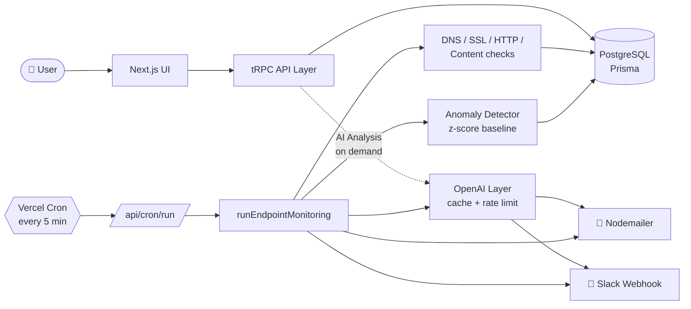
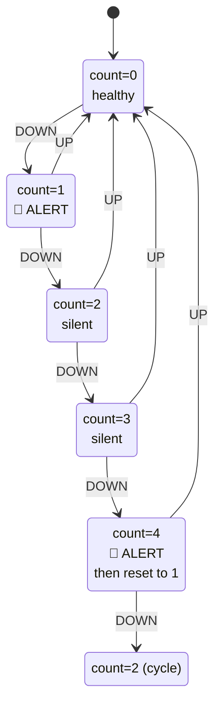

# AI-Powered Uptime Monitor

Production-grade website uptime monitoring with **AI root cause analysis**, statistical anomaly detection, and predictive warnings — built on Next.js 16, Prisma 7, tRPC, and OpenAI.

---

## ✨ Features

- 🔍 **Multi-project endpoint monitoring** — DNS, SSL, HTTP, content-hash on every check
- 🤖 **AI Root Cause Analysis** — structured JSON diagnosis (category + likely cause + confidence + recommended actions) via GPT-4o-mini
- 📈 **Statistical anomaly detection** — 7-day rolling baseline catches degradation before outage (no LLM, free)
- 🚨 **Smart anti-spam alerts** — counter-based DOWN cadence (1st alert + every 4th)
- 🔮 **Predictive warnings** — SSL expiry (14 days early) + unstable endpoint flagging
- 🧾 **Materialized incident table** — fast queries, no log replay
- 📊 **Dashboard analytics** — uptime trends, response times, slowest endpoints, notification stats
- 🌐 **Public status pages** — 90-day uptime visualization, custom slug
- 🔐 **Encrypted secrets** — AES-256-GCM for Slack webhooks
- ✉️ **Multi-channel alerts** — Email (Nodemailer) + Slack (encrypted webhook)
- 🔑 **OAuth login** — Google + GitHub via Better Auth

---

## 🏗️ Architecture



### Per-tick monitoring flow


### Anti-spam alert state machine



---

## ⚙️ Setup

### 1. Clone & install

```bash
git clone <repo-url>
cd fyp
pnpm install
```

### 2. Environment variables

Copy `.env.example` to `.env` and fill in:

```env
DATABASE_URL="postgresql://..."
BETTER_AUTH_SECRET="<openssl rand -hex 32>"
BETTER_AUTH_URL="http://localhost:3000"
GOOGLE_CLIENT_ID="..."
GOOGLE_CLIENT_SECRET="..."
SMTP_USER="your@gmail.com"
SMTP_PASS="<gmail-app-password>"
ENCRYPTION_KEY="<openssl rand -hex 32>"
OPENAI_API_KEY="sk-..."
CRON_SECRET="<openssl rand -hex 32>"   # production only
```

### 3. Database

```bash
pnpm db:push        # apply schema
pnpm db:generate    # regenerate Prisma client
```

### 4. Run

```bash
pnpm dev            # http://localhost:3000
pnpm cron           # local monitoring (separate terminal)
```

---

## 🚀 Production deployment (Vercel)

1. Push to GitHub
2. Import in Vercel
3. Add all env vars (including `CRON_SECRET`)
4. Deploy — `vercel.json` registers the cron job automatically

The local `pnpm cron` script is **not** used in production. Vercel Cron hits `/api/cron/run` every 5 minutes.

---

## 🧪 Tests

```bash
pnpm test          # vitest run
pnpm test:watch    # watch mode
```

26 tests covering: HTTP code classification, network error classification, anomaly detector baseline math + thresholds, AES-256-GCM round-trip + tamper detection.

---

## 📦 Tech Stack

| Layer | Tech |
|---|---|
| Frontend | Next.js 16, React 19, Tailwind v4, Shadcn UI |
| API | tRPC 11, Zod |
| Auth | Better Auth (Google + GitHub OAuth) |
| Database | PostgreSQL via Prisma 7 |
| AI | OpenAI gpt-4o-mini (alerts + structured root cause) |
| Alerts | Nodemailer (email) + axios (Slack webhook, encrypted) |
| Cron | Vercel Cron (prod) / node-cron (dev) |
| Tests | Vitest |

---

## 📚 Documentation

- [`agent.md`](agent.md) — full system context for AI assistants
- [`project_structure.md`](project_structure.md) — folder map + module reference
- [`.env.example`](.env.example) — env var reference

---

## 🔗 References

- [Next.js](https://nextjs.org/docs) · [Prisma](https://www.prisma.io/docs) · [tRPC](https://trpc.io/docs) · [Better Auth](https://docs.better-auth.com)
- [OpenAI structured outputs](https://platform.openai.com/docs/guides/structured-outputs)
- [Vercel Cron](https://vercel.com/docs/cron-jobs)
- [Shadcn UI](https://ui.shadcn.com/docs)
