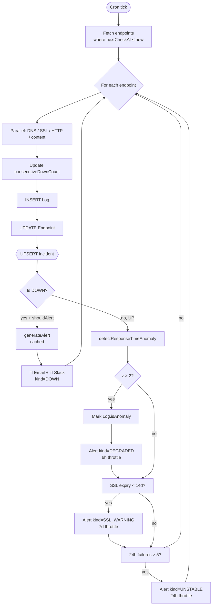
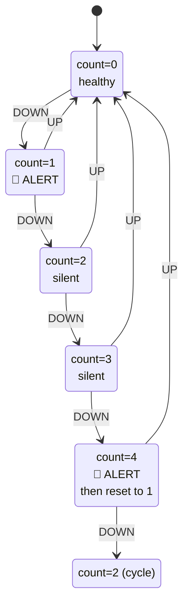

# AI-Powered Uptime & Security Monitor

Production-grade website uptime monitoring with **AI root cause analysis**, statistical anomaly detection, predictive warnings, and an **AI-triaged security scanner** — built on Next.js 16, Prisma 7, tRPC, and OpenAI.

---

## ✨ Features

- 🔍 **Multi-project endpoint monitoring** — DNS, SSL, HTTP, content-hash on every check
- 🤖 **AI Root Cause Analysis** — structured JSON diagnosis (category + likely cause + confidence + recommended actions) via GPT-4o-mini
- 📈 **Statistical anomaly detection** — 7-day rolling baseline catches degradation before outage (no LLM, free)
- 🚨 **Smart anti-spam alerts** — counter-based DOWN cadence (1st alert + every 4th)
- 🔮 **Predictive warnings** — SSL expiry (14 days early) + unstable endpoint flagging
- 🧠 **Predictive health scoring** — explainable failure-risk model (weighted signals) + response-time forecasting via linear regression (statistical, no LLM)
- 📝 **Content-change / defacement detection** — SHA-256 body hash compared across checks (12h throttle)
- 🛡️ **Security posture scanner** — security headers, TLS/SSL depth, exposed sensitive files, cookie flags, HTTPS enforcement, SPF/DMARC/CAA, tech fingerprinting → weighted **A–F score**
- 🧠 **AI vulnerability triage** — turns raw findings into a prioritized, plain-English remediation plan (structured JSON)
- 🧾 **Materialized incident table** — fast queries, no log replay
- 📊 **Dashboard analytics** — uptime trends, response times, slowest endpoints, notification stats
- 🌐 **Public status pages** — 90-day uptime visualization, custom slug
- 🔐 **Encrypted secrets** — AES-256-GCM for Slack webhooks
- ✉️ **Multi-channel alerts** — Email (Nodemailer) + Slack (encrypted webhook)
- 🔑 **OAuth login** — Google + GitHub via Better Auth

---

## 🏗️ Architecture


### Per-tick monitoring flow



### Anti-spam alert state machine



---

## ⚙️ Setup

### 1. Clone & install

```bash
git clone <repo-url>
cd fyp
pnpm install
```

### 2. Environment variables

Copy `.env.example` to `.env` and fill in:

```env
DATABASE_URL="postgresql://..."
BETTER_AUTH_SECRET="<openssl rand -hex 32>"
BETTER_AUTH_URL="http://localhost:3000"
GOOGLE_CLIENT_ID="..."
GOOGLE_CLIENT_SECRET="..."
SMTP_USER="your@gmail.com"
SMTP_PASS="<gmail-app-password>"
ENCRYPTION_KEY="<openssl rand -hex 32>"
OPENAI_API_KEY="sk-..."
CRON_SECRET="<openssl rand -hex 32>"   # production only
```

### 3. Database

```bash
pnpm db:push        # apply schema
pnpm db:generate    # regenerate Prisma client
```

### 4. Run

```bash
pnpm dev            # http://localhost:3000
pnpm cron           # local monitoring (separate terminal)
```

---

## 🚀 Production deployment (Vercel)

1. Push to GitHub
2. Import in Vercel
3. Add all env vars (including `CRON_SECRET`)
4. Deploy — `vercel.json` registers the cron job automatically

The local `pnpm cron` script is **not** used in production. Vercel Cron hits `/api/cron/run` every 5 minutes.

---

## 🧪 Tests

```bash
pnpm test          # vitest run
pnpm test:watch    # watch mode
```

26 tests covering: HTTP code classification, network error classification, anomaly detector baseline math + thresholds, AES-256-GCM round-trip + tamper detection.

---

## 📦 Tech Stack

| Layer | Tech |
|---|---|
| Frontend | Next.js 16, React 19, Tailwind v4, Shadcn UI |
| API | tRPC 11, Zod |
| Auth | Better Auth (Google + GitHub OAuth) |
| Database | PostgreSQL via Prisma 7 |
| AI | OpenAI gpt-4o-mini (alerts + structured root cause) |
| Alerts | Nodemailer (email) + axios (Slack webhook, encrypted) |
| Cron | Vercel Cron (prod) / node-cron (dev) |
| Tests | Vitest |

---

## 📚 Documentation

- [`agent.md`](agent.md) — full system context for AI assistants
- [`project_structure.md`](project_structure.md) — folder map + module reference
- [`.env.example`](.env.example) — env var reference

---

## 🧠 Predictive Health

Per-endpoint failure-risk prediction (`prediction` tRPC router → `src/lib/failure-predictor.ts`) — **fully explainable, no LLM**:

- **Least-squares linear regression** on recent UP samples → response-time trend + a 24h forecast
- A **weighted risk model** turns real signals into a 0–100 score where every point is attributable to a named factor: recent failures (≤40), overall error rate (≤15), slowing response time (≤10), response-time spike vs baseline (≤15), active down streak (≤20), approaching SSL expiry (≤10), recent instability (≤10)
- Score → `LOW / MEDIUM / HIGH / CRITICAL`, with the contributing factors surfaced in the UI so operators see **why** an endpoint is at risk

Computed live from existing logs (no schema change, no AI cost). Pure math (`linearRegression`, `computeRiskScore`) is unit-tested; DB access is isolated in the orchestrator.

## 🛡️ Security Scanner

On-demand, per-endpoint posture scan (`security` tRPC router → `src/lib/security-scanner.ts`). Seven categories, each producing pass/fail findings with a severity:

| Category | Checks |
|---|---|
| Security Headers | HSTS, CSP, X-Frame-Options, X-Content-Type-Options, Referrer-Policy, Permissions-Policy |
| TLS / SSL | negotiated protocol (flags TLS 1.0/1.1), trust chain / self-signed |
| Exposed Files | `/.env`, `/.git/config`, `/.aws/credentials`, backups… (200 + non-HTML only → avoids SPA false positives) |
| Cookie Security | Secure / HttpOnly / SameSite on every Set-Cookie |
| HTTPS Enforcement | HTTP→HTTPS redirect + HSTS |
| DNS / Email | SPF, DMARC, CAA records |
| Tech Fingerprint | `Server` / `X-Powered-By` disclosure + EOL PHP heuristic |

A weighted penalty model (CRITICAL −40 … LOW −5) yields a **0–100 score** and an **A–F grade**, persisted to the `SecurityScan` table so history/trends survive restarts. **AI triage** (`analyzeSecurityPosture`) then prioritizes the failed findings into an ordered remediation plan — sharing the same cache + 50/hr rate-limit as the incident analyzer.

Scans run two ways: **on-demand** (the "Run Scan" button) and **automatically** via the cron — `runDueSecurityScans()` re-scans each endpoint at most once per 24h, a max of 5 per tick so a burst never blows the serverless time budget. Auto-scan is scan-only; AI triage stays user-triggered to keep OpenAI cost bounded.

## 🧭 Design Decisions & Trade-offs

Deliberate engineering choices (not oversights) — worth knowing for evaluation:

- **5-minute check floor** — Vercel Cron fires every 5 min and each tick carries serverless + OpenAI cost, so the minimum interval is 5 min. Sub-minute monitoring needs a dedicated always-on worker/queue (see Future Work).
- **In-memory AI cache is best-effort** — the `Map` caches in `openAI.ts` de-duplicate work *within* a single cron run but reset on serverless cold starts. The durable layers that survive restarts are DB-backed: root-cause analysis (`Incident.aiAnalysis`) and the per-user rate limit (`Setting.aiCallsCount`). A shared Redis/Upstash cache is the planned upgrade.
- **Single-region probing** — checks run from one region, so a network glitch between the checker and the target can produce a false DOWN. Consensus-based multi-region checking is Future Work.
- **Statistical anomaly detection over ML model** — z-score on a rolling baseline is transparent, free, needs no training data, and runs on every UP check. The LLM is reserved for explanation, not core detection.

## 🗺️ Future Work

- **Multi-region checks** — probe from ≥3 regions, mark DOWN only on a 2-of-3 consensus to eliminate network false positives
- **Redis/Upstash shared cache** — cross-instance AI + probe caching that survives serverless cold starts
- **Sub-minute monitoring** — dedicated worker / queue (e.g. BullMQ) for 30s–60s intervals on critical endpoints
- **Content-diff on change** — beyond the hash signal, store and diff the actual body to show *what* changed
- **Trend-based prediction** — regression on downtime/SSL/response-time history for earlier warnings

## 🔗 References

- [Next.js](https://nextjs.org/docs) · [Prisma](https://www.prisma.io/docs) · [tRPC](https://trpc.io/docs) · [Better Auth](https://docs.better-auth.com)
- [OpenAI structured outputs](https://platform.openai.com/docs/guides/structured-outputs)
- [Vercel Cron](https://vercel.com/docs/cron-jobs)
- [Shadcn UI](https://ui.shadcn.com/docs)
